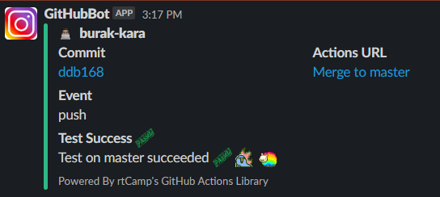
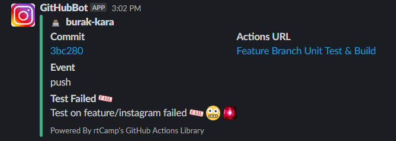

# Actions and Workflows

This repository contains a collection of actions and workflows that can be used in your GitHub Actions and Workflows.
It tests, builds and create pull request the project while notifying your Slack channel after each action (e.g., test, build, create PR) with its status (e.g., success, fail).

It also contains set of actions from the [GitHub Actions Marketplace](https://github.com/marketplace?type=actions). 
They are:
- [actions/checkout@v3](https://github.com/marketplace/actions/checkout)
- [tj-actions/branch-names@v6](https://github.com/marketplace/actions/branch-names)
- [actions/setup-node@v3](https://github.com/marketplace/actions/setup-node-js-environment)
- [rtCamp/action-slack-notify@v2](https://github.com/marketplace/actions/slack-notify)
- [devops-infra/action-pull-request@v0.5.0](https://github.com/marketplace/actions/github-action-for-creating-pull-requests)

## Workflow
- Test `feature/*` branch on push to remote
- Notify Slack channel on test success/fail
- If test success, build `feature/*` branch
- Notify Slack channel on build success/fail
- If build success, create pull request from `feature/*` to `master` branch
- Notify Slack channel on pull request creation success/fail
- Merge pull request to `master` branch _(this is manuel action)_
- Test `master` branch on push to `master`
- Notify Slack channel on test success/fail
- If test success, build `master` branch
- Notify Slack channel on build success/fail

### TODO
- Deploy project after successful build of `master` branch

## Usage
To use this workflow, you can copy the entire [.github](.github) folder and paste it into your root directory.
Then, you can modify the workflows to suit your needs.

You need to create a [GitHub Secrets](https://docs.github.com/en/actions/security-guides/encrypted-secrets#creating-encrypted-secrets-for-a-repository) named;
- `CHANNEL_NAME` and set its value to your Slack channel name. (e.g., general, random)
- `PAT` and set its value to your GitHub Personal Access Token. Needs to have repo scope access. Refer [here](https://docs.github.com/en/authentication/keeping-your-account-and-data-secure/creating-a-personal-access-token)
- `SLACK_WEBHOOK` and set its value to your Slack webhook URL. Get one [here](https://slack.com/apps/A0F7XDUAZ-incoming-webhooks).

You can provide your Slack Message icon by modifying the `SLACK_ICON` in the [slack-notifier](.github/actions/slack-notifier/action.yml) file.
Please refer the action links above for more information and customization. 

To use custom emojis in your Slack notification, you can use [this](https://slackmojis.com/) list. 
Download emojis you want to use and upload them to your Slack workspace. 
Then, you can use them in your Slack notification text.

#### Screenshots
On test success after merge to `master` branch

On test fail on `feature/instagram` branch

